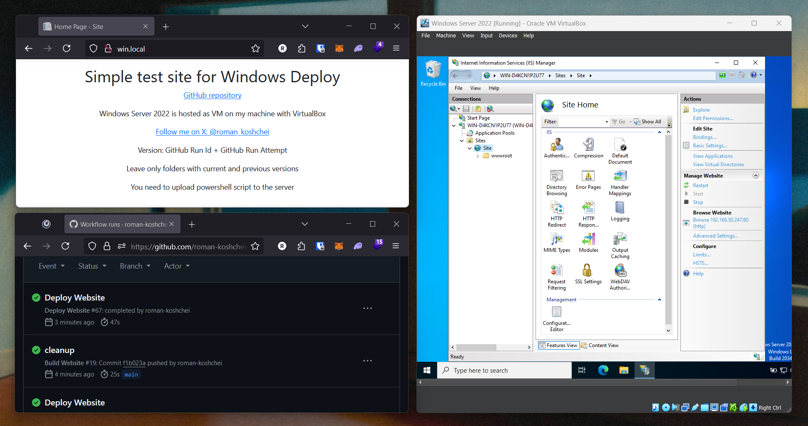

# Windows Deploy

Example of automated deployment of .NET website to Windows Server.
Windows Server is setup with IIS.



## Steps

Here are instruction of the steps you must take to make automated deployments.

### 1. Generate SSH keys

You can get instruction how to generate SSH keys for your platform on GitHub docs:
https://docs.github.com/en/authentication/connecting-to-github-with-ssh/generating-a-new-ssh-key-and-adding-it-to-the-ssh-agent

Example:

```bash
ssh-keygen -t ed25519 -C "your_email@example.com" -f win
```

### 2. Install OpenSSH Server to Windows Server

Use instructions from Microsoft Docs: https://learn.microsoft.com/en-us/windows-server/administration/openssh/openssh_install_firstuse?tabs=gui&pivots=windows-server-2022

Generally OpenSSH Client is already installed. To install OpenSSH Server go:

```
Settings -> System -> Optional Features -> OpenSSH Server
```

Ensure OpenSSH Server starts Automatically after OS loads.

### 3. Add public SSH key to Windows Server

Use public SSH key you generated before.
Create `.ssh` folder in your user directory.
Put your public key into `authorized_keys` file.

In `C:\ProgramData\ssh\sshd_config` file ensure next settings:

- Key `PubkeyAuthentication` has `yes` value.
- Key `AuthorizedKeysFile` has `.ssh/authorized_keys` value as one of available.

### 4. Install GitBash (comes with Git)

Download Git and GitBash from: https://git-scm.com/downloads

### 5. Set GitBash as default option for OpenSSH Server

It's required to make `scp` work properly. I learned it the hard way.

```powershell
New-ItemProperty -Path "HKLM:\SOFTWARE\OpenSSH" -Name DefaultShell -Value "C:\Program Files\Git\usr\bin\bash.exe" -PropertyTag String -Force
```

### 6. Create site folder and upload script

Make new folder with your site name under `C:\inetpub\wwwroot\`.
Example: `C:\inetpub\wwwroot\Site`.
Deployments will be placed in subfolders of this folder.

Copy `scripts/update.ps1` script from the repository into created folder and adjust it to match site name.

### 7. Copy and adjust workflows

Use workflows from this repository. Change `build.yaml` workflow as it suits your project.
Also change `deploy.yaml` workflow to match your site's folder name.
